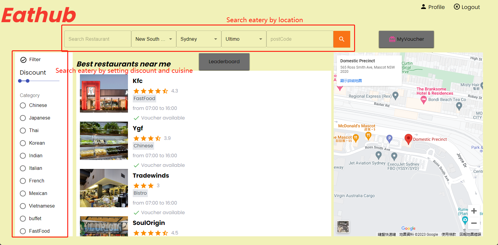
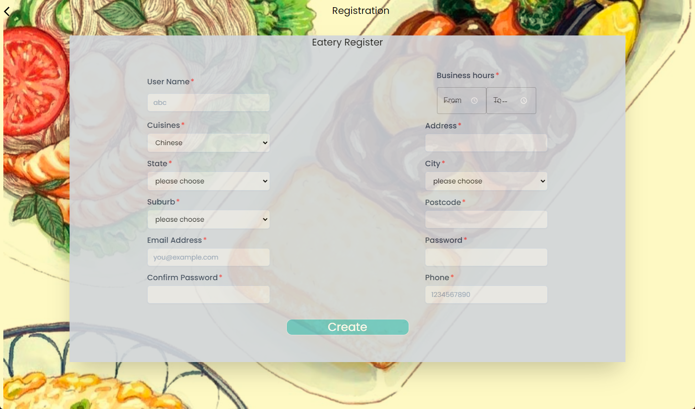

[](https://opensource.org/licenses/MIT)

# Eathub--Your Premier Eatery Management System

**Important Notice:**  

This repository contains the project work for my postgraduate degree at the University of New South Wales (UNSW) in Information Technology. In compliance with UNSW regulations and policies, the complete project code and certain details are restricted from public access for a specified period post-graduation. Consequently, this repository might not contain the full codebase or certain sensitive information pertinent to the project. 

🔐 **Confidentiality Notice:** The project and all associated materials are protected under intellectual property laws and UNSW's policies. Unauthorized copying, distribution, or public disclosure is strictly prohibited. 

📬 **Access to Full Project Code:** If you are a potential employer or interested party who requires further information or access to the complete project code for verification or review purposes, please feel free to contact me directly. 

\-📧 Email: [yueniuuw@gmail.com] 

\-💼 LinkedIn: [www.linkedin.com/in/yue-niu] 

\- 🌐 Personal Website: [www.yueniu.me]

Thank you for your understanding and cooperation. --- 

### Overview

**Eathub**, weaving a digital nexus between gourmets and gastronomy, introduces a state-of-the-art Eatery Management System, meticulously embodying a confluence where dining enthusiasts and restaurant owners convene in a symbiotic rendezvous. In an epoch tethered to culinary adventures, Eathub emerges from the crucible of necessity and innovation, aiming to facilitate seamless access to discounts, invigorate repeat patronage, and, crucially, to enkindle enriched interactions amidst patrons and eateries.

Envisaging a diversified array of user needs, Eathub employs a judiciously crafted hybrid architecture, seamlessly blending B/S (Browser/Server) and C/S (Client/Server) models, meticulously catering to two distinct user cohorts: the discerning customers and the strategic eateries.







### System Design

#### Three-tier Architecture:

- **Presentation Layer:**
  - Focused on user interface and interaction, steering functionalities like eateries display, voucher redemption, and status visualization.
- **Application Layer:**
  - A linchpin layer, enwrapping the essential business logic and processing functionalities and governing voucher, inventory, and feedback management.
- **Data Layer:**
  - A sentinel for data storage and management, leveraging a DBMS to handle diverse data realms related to user credentials, voucher specifics, inventory data, and more.

#### Technology Stack

- Front-end:
  - Design: Figma
  - Framework: React
  - State Management: Zustand
  - Styling: TailwindCSS, MaterialUI
- Back-end:
  - Framework: Flask (utilized for building RestAPI)
  - Database: MySQL

### Functions Overview

1. **User Registration and Profile Management:**
   - Facilitates distinct registration pathways and profile management for customers and restaurant owners.
2. **Customizable Discount Coupons Creation:**
   - Enables restaurant owners to curate and disseminate custom-tailored discount coupons, while also allowing customers to reserve these perks.
3. **Scheduled Discount Distributions:**
   - Offers automated, scheduled distribution of discount coupons, fortifying customer retention and business on potentially lean days.
4. **Enhanced Discount Search and Claim Mechanism:**
   - Amplifies user experience by facilitating an intuitive discount coupon search, claim, and management system.
5. **Stringent Coupon Verification and Usage:**
   - Safeguards discount system integrity via secure, verifiable coupon code generation, application, and validation mechanisms.
6. **Historical Data Review and Rating:**
   - Enables users to traverse their usage history, and leave ratings and reviews, thus fostering a transparent and trustworthy Eathub community.
7. **Intuitive Map Interaction:**
   - Integrates with Google Maps, delivering geographical context and enhancing logistical planning for diner visits.
8. **Competitive Restaurant Rating and Ranking:**
   - Encourages a competitive yet healthy environment among restaurants, by aggregating ratings and showcasing them on a transparent leaderboard.

Eathub endeavors to morph the dining-out landscape into a more connected, transparent, and user-centric experience, not just linking, but also enriching the relationship between eateries and patrons through technological innovation.

### Deployment Guide

Ensuring that our Eatery Management System (EMS) extends a seamless installation and deployment experience, we leverage Docker containers to encapsulate both the Flask-App (Backend) and React-App (Frontend). Adhering to the following step-wise guide will facilitate an effortless setup and initiation of our system.

#### Prerequisites

- Docker installed and configured. If not, kindly adhere to the [Docker Installation Guide](https://docs.docker.com/get-docker/).
- Project files, including Docker files and `docker-compose.yml`, downloaded to your system.

#### Step 1: Creating Docker Images

1. **Navigate to Project Directory:**

   - Open your terminal/command prompt.
   - Change to the root directory of the project using `cd [path_to_project_folder]`.

2. **Build Docker Images:**

   - In the terminal, execute the following command:

     ```
     Copy code
     docker-compose build
     ```

   - This may require 5-6 minutes, as it generates Docker images in alignment with the `docker-compose.yml` file.

#### Step 2: Launching Docker Containers

1. Initiate Docker Containers:

   - Execute the following command in the terminal:

     ```
     Copy code
     docker-compose up -d
     ```

   - This triggers the Docker containers utilizing the previously created images.

2. Port Information:

   - Backend (Flask-App) is accessible on: `localhost:8081`.
   - Frontend (React-App) is accessible on: `localhost:80`.

#### Step 3: Accessing the EMS Website

1. Website Access:

   - Launch Google Chrome or your preferred web browser.

   - In the address bar, input:

     ```
     makefileCopy code
     localhost:80
     ```

   - Press Enter to access the EMS website and explore its functionalities.

### Additional Notes:

- Ensure all Docker containers are running successfully by utilizing:

  ```
  Copy code
  docker-compose ps
  ```

- To halt and remove all containers, networks, and volumes defined in the 

  ```
  docker-compose.yml
  ```

   file, use:

  ```
  Copy code
  docker-compose down
  ```

- Should you encounter any issues during installation or deployment, please consult the project documentation or reach out through our support channels.

### Conclusion

The aforesaid guide outlines the elementary steps towards effectively installing and deploying the Eathub EMS in a Docker environment, thereby promising a streamlined, replicable, and encapsulated setup, primed for both development and production scenarios. As you engage with Eathub, we invite you to explore the various functionalities and features embedded within, each meticulously designed to enhance and elevate the eateries management and customer dining experience.

### Contributing

From all five team members.

This project is brought to you by:

[Yue Niu]
[Zhourui Shi]
[Lichen Zhang]
[Yimin Liu]
[Haoxian Zhang]

## License

This project is licensed under the MIT License - see the [LICENSE.txt](LICENSE.txt) file for details.